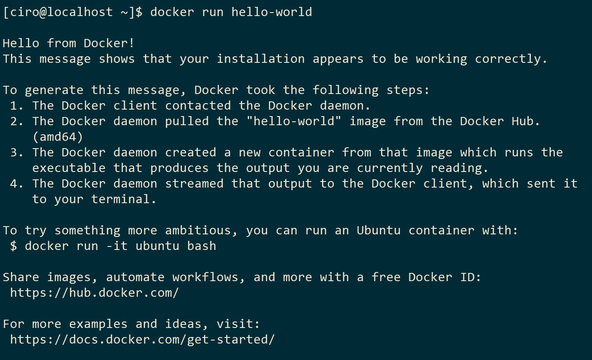
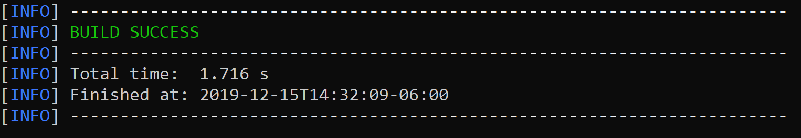
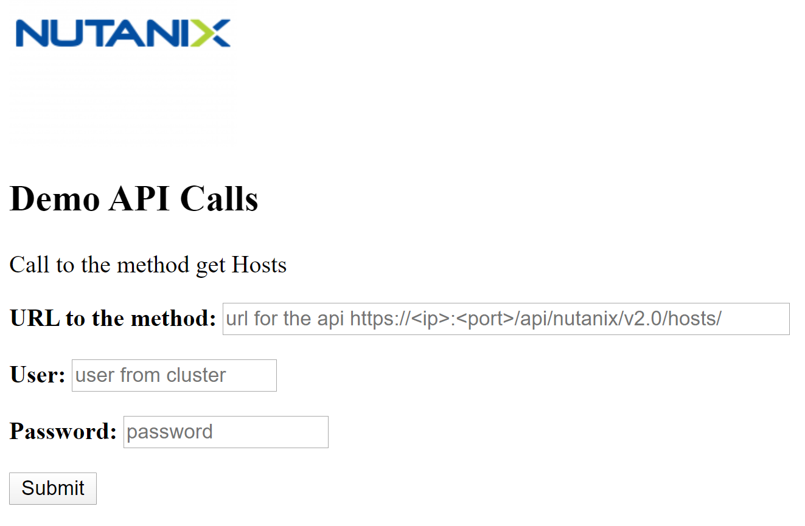
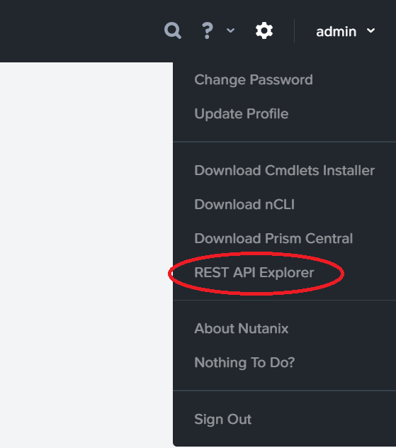
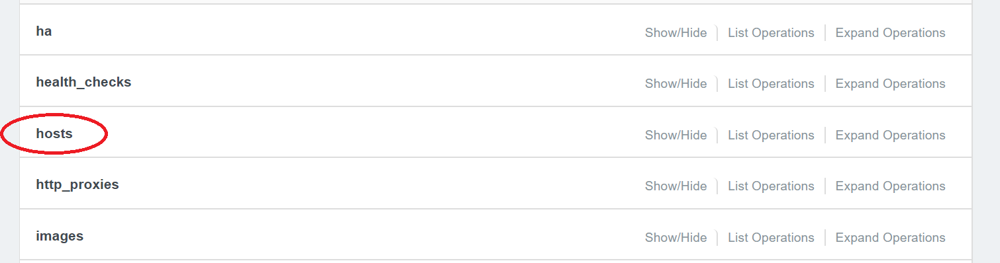
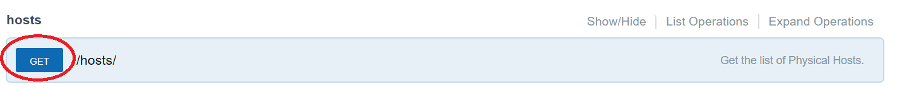
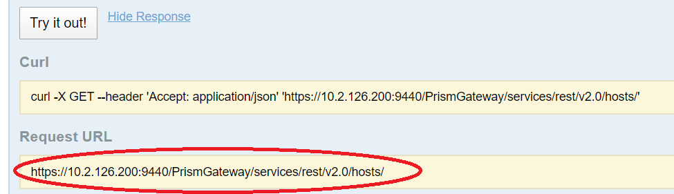
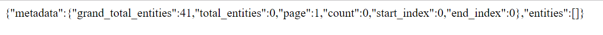
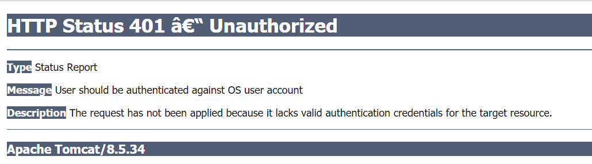

# Nutanix Demo Docker Introduction and API Calls on Java
A simple guide to create a Docker and call the API.

# Table of Contents
* [Introduction](#introduction)
* [Requirements](#requirements)
* [Implementation](#implementation)
* [Usage](#usage)
* [API](#API)
* [Karbon Cluster](#Karbon)


## Introduction
This hands on uses a Virtual Machine with Centos 7, where we are going to install Maven to download librarys, compile 
and create the Docker Image, with one container running we enter on a web page to make calls to the Nutanix API and observe the answer from any cluster that we can reach on the network.


## Requirements
### Install Java 8
You can use the file **jdk-8u231-linux-x64.rpm** inside this project. Copy to your Centos 7 virtual machine and type the following command:

```
$ rpm -i jdk-8u231-linux-x64.rpm
```
You can verify the installation by typing

```
$ java -version
```

### Install Maven
you can download from https://maven.apache.org/download.cgi or type the following command:

```
$ sudo yum -y install maven
```
You can verify the installation by typing

```
$ mvn -version
```
### Install Docker

In order to install docker on our virtual Centos Machine we need some utils follow the next commands.

On a terminal inside your Centos type the following
```
sudo yum install -y yum-utils device-mapper-persistent-data lvm2
```
Then we add the repository of docker
```
sudo yum-config-manager --add-repo https://download.docker.com/linux/centos/docker-ce.repo
```
Installing the docker commands
```
sudo yum install -y docker-ce docker-ce-cli containerd.io
```
Starting the docker service
```
sudo systemctl start docker
```
Create the docker group, maybe it is already done.
```
sudo groupadd docker
```
Add your user to the docker group.
```
sudo usermod -aG docker $USER
```
**Log out and log back in so that your group membership is re-evaluated.**

Verify that you can run docker commands without sudo.
```
docker run hello-world
```
If it is correct you can see this



Enable the docker service to run on boot.
```
sudo systemctl enable docker
echo manual | sudo tee /etc/init/docker.override
sudo chkconfig docker on
```


## Implementation
Once you have on your Centos Virtual Machine the project that clone open a terminal on the folder
**nutanix_java_api** you should see this:
:.
├───.idea<br>
├───images<br>
└───src<br>
    &nbsp; └───main<br>
     &nbsp; &nbsp;    ├───java<br>
     &nbsp; &nbsp;     │   └───com<br>
     &nbsp; &nbsp;     │       └───nutanix<br>
     &nbsp; &nbsp;     │           └───api<br>
     &nbsp;  &nbsp;    └───resources<br>
     &nbsp;  &nbsp; &nbsp;       └───public<br>
            
### Clean and Compile the project
```
mvn clean compile
```
If it is correct you should something like this


Open a terminal and go to the path /nutanix_java_api/src/main/java/com/nutanix/api.

Use **vi** or any editor and edit **line 83** of file **RestClient.java**
you should see on line 83 the following:
```
app.get("/", ctx -> ctx.result("Hello World!!! Nutanix Demo Ciro"));
```
&#x1F534;<font color="red">Replace the word **"Ciro"** with your **own name** &#x1F534;</font>

Compile again you should see BUILD SUCCESS
```
mvn clean compile
```
### Create the jar
```
mvn clean compile assembly:single
```
### Create the docker image
```
mvn clean compile assembly:single dockerfile:build
```
&#x1F534; In order to push the image to Docker Hub you have to login on docker

&#x1F534;&#x1F534; **User**: pendril **Passwd**: *******
```
export DOCKER_ID_USER="pendril"
docker login
```
### Now Push the Image
```
mvn dockerfile:push
```

## Usage

If you follow the implementation now you have a image "pendril/demonutanix" on **Docker Hub**

You can run the container with the following command
```
docker run -p 7000:7000 pendril/demonutanix
```

To see if it is running open a browser on http://localhost:7000
you should see the next
**Hello World!!! Nutanix Demo **
or from a terminal you could type
```
curl http://localhost:7000
```

## API 
Get the IP Address of your virtual machine, then with a Browser go to the following url

http://ip_centos7:7000/index.html 



 
### Find the url of the API
On a **Lab cluster** go to Prism Console

On the right corner clic on **REST API Explorer**



then clic on **hosts**


then on the blue botton GET of hosts


and it display a button **Try it out!** clic on it and copy the **Request URL**


### Go to the url

http://ip_centos7:7000/index.html


Paste on the field **URL to the method** the **Request URL** you got

Field the user of that LAB Cluster, example **admin**

Field the password of that LAB Cluster, example **nutanix**

clic on **Submit**

You should see some answer like this


If you got an image like the following **your credentials are incorrect**



## Karbon

In order to deploy in a **Karbon Cluster**  proceed with the following settings:
* Setup metallb to be able create a LoadBalancer service in Karbon
  * To install MetalLB, apply the manifest:
  ```
  kubectl apply -f https://raw.githubusercontent.com/google/metallb/v0.8.3/manifests/metallb.yaml
  ```
This will deploy MetalLB to your cluster, under the **metallb-system namespace**. The components in the manifest are:
 * The **metallb-system/controller deployment**. This is the cluster-wide controller that handles IP address assignments.
 * The **metallb-system/speaker daemonset**. This is the component that speaks the protocol(s) of your choice to make the services reachable.
Service accounts for the controller and speaker, along with the RBAC permissions that the components need to function.

After that, the following ConfigMap need to be created on the same namespance, it will contain the IP addresses available for the LoadBalancer service.
For example, the following configuration gives MetalLB control over IPs from 192.168.1.240 to 192.168.1.250, and configures Layer 2 mode:
```
apiVersion: v1
kind: ConfigMap
metadata:
  namespace: metallb-system
  name: config
data:
  config: |
    address-pools:
    - name: default
      protocol: layer2
      addresses:
      - 192.168.1.240-192.168.1.250
```
Layer 2 mode does not require the IPs to be bound to the network interfaces of your worker nodes. It works by responding to ARP requests on your local network directly, to give the machine’s MAC address to clients.

After the Metallb settings are done, use the following YAML to deploy the containers and the LoadBalance service.
```
apiVersion: extensions/v1beta1
kind: Deployment
metadata:
  name: demonutanix
spec:
  replicas: 3
  template:
    metadata:
      labels:
        app: demonutanix
    spec:
      containers:
        - name: demonutanix
          image: pendril/demonutanix
          ports:
            - containerPort: 7000

---
apiVersion: v1
kind: Service
metadata:
  name: demonutanix-service
  labels:
    name: demonutanix-service
spec:
  ports:
    - port: 7000
      targetPort: 7000
      protocol: TCP
      name: web
  selector:
    app: demonutanix
  type: LoadBalancer
```
And apply it by executing the yaml file with kubectl:
```
kubectl apply -f deployment.yaml
```

You can check the LoadBalancer service IP **(EXTERNAL-IP)** in which your application is exposed by running the following command:
```
kubectl get svc
NAME                  TYPE           CLUSTER-IP       EXTERNAL-IP    PORT(S)          AGE
demonutanix-service   LoadBalancer   172.19.206.179   10.10.69.200   7000:31081/TCP   7s
```


